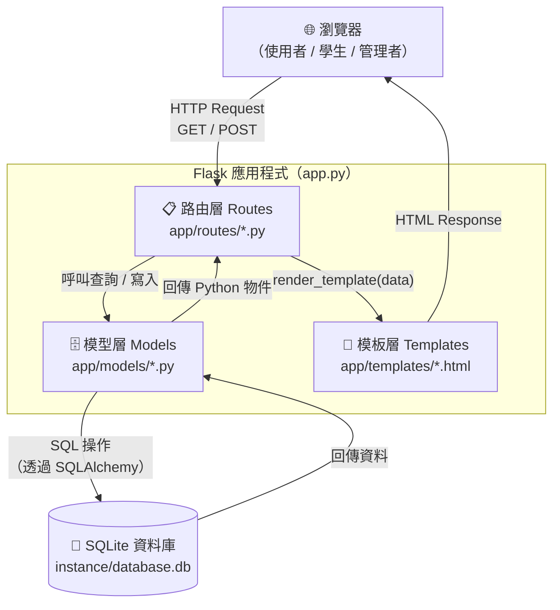
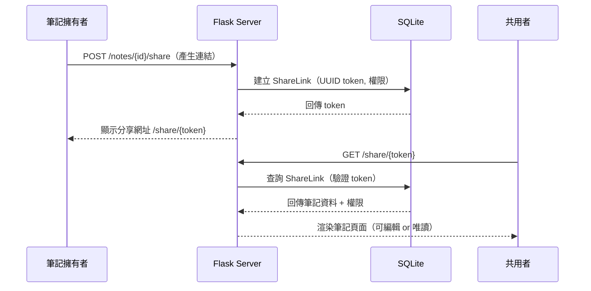
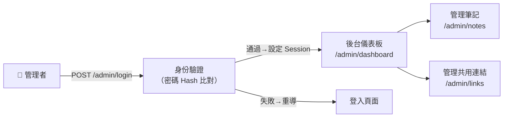

# 🏗️ 讀書筆記本系統 — 系統架構文件（ARCHITECTURE）

> **版本**：v1.0  
> **建立日期**：2026-04-09  
> **參考文件**：docs/PRD.md v1.0

---

## 1. 技術架構說明

### 1.1 選用技術與原因

| 技術 | 版本建議 | 選用原因 |
|------|----------|----------|
| **Python + Flask** | Python 3.10+, Flask 3.x | 輕量框架，學習曲線低，適合中小型 Web 專題 |
| **Jinja2** | 隨 Flask 內建 | 與 Flask 深度整合，在伺服器端渲染 HTML，無需前後端分離 |
| **SQLite** | 內建於 Python | 零設定資料庫，方便本機開發與學校環境部署 |
| **SQLAlchemy** | 2.x | ORM 工具，防止 SQL Injection，讓資料庫操作更直觀 |
| **Vanilla CSS + JavaScript** | — | 不依賴框架，降低環境複雜度，適合教學場景 |

### 1.2 Flask MVC 模式說明

本系統採用 **MVC（Model / View / Controller）** 架構分層，讓程式碼職責清楚：

```
┌─────────────────────────────────────────────────────────┐
│                        MVC 架構                          │
│                                                         │
│  M（Model）       app/models/                           │
│  ─────────────────────────────                          │
│  負責定義資料結構（資料表）與資料庫操作邏輯               │
│  例如：Subject（科目）、Note（筆記）、Tag（標籤）        │
│                                                         │
│  V（View）        app/templates/                        │
│  ─────────────────────────────                          │
│  Jinja2 HTML 模板，負責將資料渲染成使用者看到的頁面      │
│  例如：note_list.html、note_edit.html                   │
│                                                         │
│  C（Controller）  app/routes/                           │
│  ─────────────────────────────                          │
│  Flask 路由函式，負責接收請求、呼叫 Model、回傳 View     │
│  例如：notes.py 處理筆記的 CRUD 路由                    │
└─────────────────────────────────────────────────────────┘
```

---

## 2. 專案資料夾結構

```
讀書筆記本系統/
│
├── app/                          ← 應用程式主體
│   │
│   ├── __init__.py               ← 建立 Flask app、初始化資料庫、註冊 Blueprint
│   │
│   ├── models/                   ← M（Model）資料庫模型
│   │   ├── __init__.py
│   │   ├── subject.py            ← Subject 科目資料表
│   │   ├── note.py               ← Note 筆記資料表
│   │   ├── tag.py                ← Tag 標籤資料表
│   │   ├── note_tag.py           ← NoteTag 筆記-標籤關聯表
│   │   └── share_link.py         ← ShareLink 共用連結資料表
│   │
│   ├── routes/                   ← C（Controller）Flask 路由
│   │   ├── __init__.py
│   │   ├── main.py               ← 首頁、搜尋路由
│   │   ├── subjects.py           ← 科目 CRUD 路由
│   │   ├── notes.py              ← 筆記 CRUD 路由
│   │   ├── tags.py               ← 標籤管理路由
│   │   ├── share.py              ← 共用連結產生、驗證路由
│   │   ├── summary.py            ← 統整摘要路由
│   │   ├── export.py             ← 筆記匯出路由（PDF / Markdown）
│   │   └── admin.py              ← 管理者後台路由
│   │
│   ├── templates/                ← V（View）Jinja2 HTML 模板
│   │   ├── base.html             ← 共用版型（導覽列、CSS 引入）
│   │   ├── index.html            ← 首頁（科目列表）
│   │   ├── search.html           ← 全文搜尋結果頁
│   │   │
│   │   ├── subjects/
│   │   │   ├── list.html         ← 科目列表
│   │   │   ├── create.html       ← 新增科目
│   │   │   └── detail.html       ← 科目下的筆記列表
│   │   │
│   │   ├── notes/
│   │   │   ├── create.html       ← 新增筆記
│   │   │   ├── edit.html         ← 編輯筆記（含富文字編輯器）
│   │   │   ├── view.html         ← 閱讀筆記（唯讀）
│   │   │   └── summary.html      ← 科目統整摘要
│   │   │
│   │   ├── tags/
│   │   │   └── list.html         ← 標籤管理與篩選
│   │   │
│   │   └── admin/
│   │       ├── dashboard.html    ← 管理者後台首頁
│   │       ├── notes.html        ← 管理筆記列表
│   │       └── links.html        ← 管理共用連結
│   │
│   └── static/                   ← 靜態資源（CSS / JS）
│       ├── css/
│       │   └── style.css         ← 全站樣式
│       └── js/
│           ├── editor.js         ← 富文字編輯器整合
│           └── search.js         ← 搜尋關鍵字高亮邏輯
│
├── instance/
│   └── database.db               ← SQLite 資料庫檔案（自動產生，不進 Git）
│
├── app.py                        ← 應用程式入口，啟動 Flask server
├── config.py                     ← 設定檔（SECRET_KEY、DB 路徑等）
├── requirements.txt              ← Python 套件清單
├── .gitignore                    ← 排除 instance/、__pycache__/ 等
└── docs/
    ├── PRD.md                    ← 產品需求文件
    └── ARCHITECTURE.md           ← 本文件
```

---

## 3. 元件關係圖

### 3.1 整體系統資料流



### 3.2 共用連結協作流程



### 3.3 管理者後台存取流程



---

## 4. 關鍵設計決策

### 決策 1：使用 Flask Blueprint 拆分路由

**問題**：所有路由若寫在同一個 `app.py`，隨功能增加會難以維護。  
**決策**：使用 Flask **Blueprint** 將路由依功能拆分到 `app/routes/` 的各個模組（`notes.py`、`subjects.py`、`admin.py` 等）。  
**好處**：每個功能模組獨立，分工開發時不會互相衝突。

---

### 決策 2：共用連結使用 UUID Token（無需登入）

**問題**：PRD 要求擁有網址者即可編輯，但不能讓所有人都能任意存取所有筆記。  
**決策**：每個分享連結使用 `uuid.uuid4()` 產生唯一 Token，儲存在 `ShareLink` 資料表，並記錄**權限（可編輯 / 唯讀）** 與**到期時間**。  
**好處**：安全性佳（Token 難以猜測），且實作簡單，不需要完整的使用者帳號系統。

---

### 決策 3：富文字編輯器使用前端 JS 函式庫（Quill.js）

**問題**：PRD 要求支援富文字編輯（粗體、標題、條列），純 `<textarea>` 無法滿足。  
**決策**：在 `editor.js` 整合 [Quill.js](https://quilljs.com/)（開源、免安裝、CDN 引入），將編輯後的 HTML 存入資料庫。  
**好處**：輕量、無需 npm，直接從 CDN 引入即可；輸出為 HTML，Jinja2 可直接用 `{{ note.content | safe }}` 渲染。

---

### 決策 4：管理者驗證使用 Flask Session（非 JWT）

**問題**：管理者後台需要身份驗證，但不需要複雜的 Token 系統。  
**決策**：使用 Flask 內建的 **Session** 機制，登入後將 `admin=True` 存入 Session，並在每個管理路由前用 `before_request` 或裝飾器檢查。  
**好處**：實作簡單，適合學校專題規模，不需要引入額外套件。

---

### 決策 5：SQLite 資料庫放在 `instance/` 資料夾並加入 .gitignore

**問題**：`database.db` 包含使用者資料，不應進入 Git 版本控制。  
**決策**：遵循 Flask 慣例，將 SQLite 檔案存放於 `instance/database.db`，並在 `.gitignore` 排除整個 `instance/` 目錄。首次執行時由 `app.py` 自動建立資料表（`db.create_all()`）。  
**好處**：保護資料隱私，也避免不同成員的資料庫互相覆蓋。

---

## 5. 技術堆疊一覽

```
┌──────────────────────────────────┐
│          瀏覽器（使用者端）        │
│  HTML + Vanilla CSS + Quill.js   │
└────────────────┬─────────────────┘
                 │ HTTP
┌────────────────▼─────────────────┐
│        Flask（Python 後端）       │
│  路由 Blueprint + Jinja2 模板     │
│  SQLAlchemy ORM                  │
└────────────────┬─────────────────┘
                 │ SQL
┌────────────────▼─────────────────┐
│      SQLite（instance/db）        │
│  subjects / notes / tags /       │
│  note_tags / share_links /       │
│  admins                          │
└──────────────────────────────────┘
```

---

*本文件由 Antigravity AI 輔助產出，請團隊在開發前確認並調整。*
