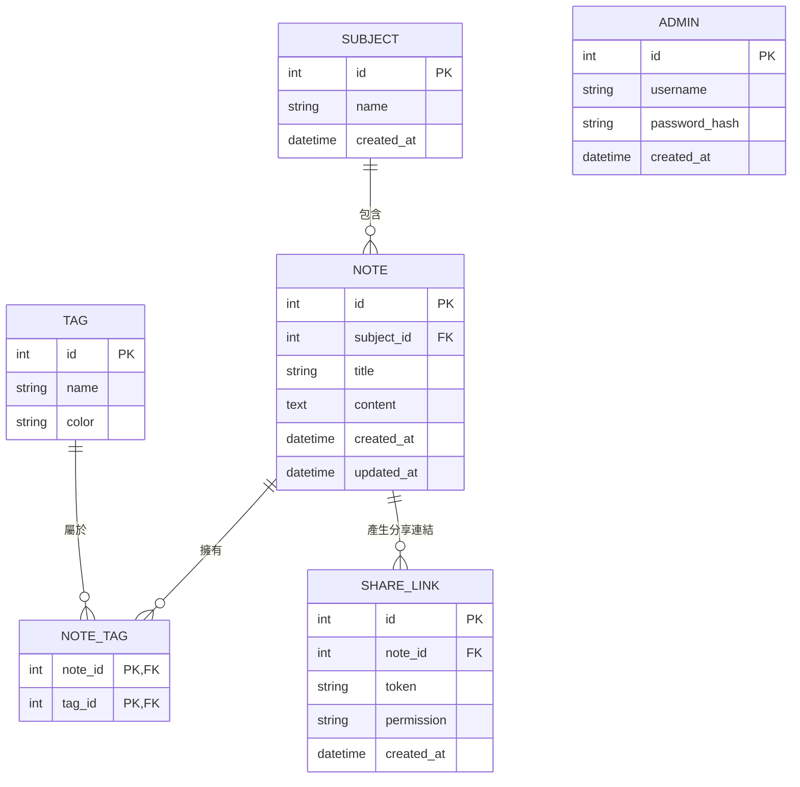

# 🗄️ 讀書筆記本系統 — 資料庫設計文件（DB DESIGN）

> **版本**：v1.0  
> **建立日期**：2026-04-16  
> **狀態**：完成

---

## 1. ER 圖（實體關係圖）

---

## 2. 資料表詳細說明

### 2.1 SUBJECT（科目資料表）
用於儲存科目分類（如：數學、英文）。

| 欄位名稱 | 型別 | 必填 | 主鍵 / 外鍵 | 說明 |
|----------|------|------|-------------|------|
| `id` | INTEGER | 是 | PK | 科目唯一識別碼，自動遞增 |
| `name` | VARCHAR(255) | 是 | - | 科目名稱 |
| `created_at` | DATETIME | 是 | - | 建立時間 |

### 2.2 NOTE（筆記資料表）
用於儲存單篇筆記的標題與富文字內容。

| 欄位名稱 | 型別 | 必填 | 主鍵 / 外鍵 | 說明 |
|----------|------|------|-------------|------|
| `id` | INTEGER | 是 | PK | 筆記唯一識別碼，自動遞增 |
| `subject_id` | INTEGER | 是 | FK | 關聯至 SUBJECT.id |
| `title` | VARCHAR(255) | 是 | - | 筆記標題 |
| `content` | TEXT | 否 | - | 筆記 HTML 內容 |
| `created_at` | DATETIME | 是 | - | 建立時間 |
| `updated_at` | DATETIME | 否 | - | 最後更新時間 |

### 2.3 TAG（標籤資料表）
用於儲存自訂標籤（如：重要、待複習）。

| 欄位名稱 | 型別 | 必填 | 主鍵 / 外鍵 | 說明 |
|----------|------|------|-------------|------|
| `id` | INTEGER | 是 | PK | 標籤唯一識別碼，自動遞增 |
| `name` | VARCHAR(50) | 是 | - | 標籤名稱 |
| `color` | VARCHAR(20) | 否 | - | 標籤顏色 |

### 2.4 NOTE_TAG（筆記與標籤關聯表）
記錄筆記與標籤的多對多關係。

| 欄位名稱 | 型別 | 必填 | 主鍵 / 外鍵 | 說明 |
|----------|------|------|-------------|------|
| `note_id` | INTEGER | 是 | PK, FK | 關聯至 NOTE.id |
| `tag_id` | INTEGER | 是 | PK, FK | 關聯至 TAG.id |

### 2.5 SHARE_LINK（共用連結資料表）
用於記錄透過網址分享的筆記權限與 Token。

| 欄位名稱 | 型別 | 必填 | 主鍵 / 外鍵 | 說明 |
|----------|------|------|-------------|------|
| `id` | INTEGER | 是 | PK | 分享連結唯一識別碼，自動遞增 |
| `note_id` | INTEGER | 是 | FK | 關聯至 NOTE.id |
| `token` | VARCHAR(255) | 是 | - | 唯一的 UUID Token |
| `permission` | VARCHAR(20) | 是 | - | 權限：'edit' 或 'read' |
| `created_at` | DATETIME | 是 | - | 建立時間 |

### 2.6 ADMIN（管理者資料表）
用於存放後台管理員帳號與密碼 Hash。

| 欄位名稱 | 型別 | 必填 | 主鍵 / 外鍵 | 說明 |
|----------|------|------|-------------|------|
| `id` | INTEGER | 是 | PK | 管理者唯一識別碼，自動遞增 |
| `username` | VARCHAR(50) | 是 | - | 登入帳號（Unique）|
| `password_hash` | VARCHAR(255)| 是 | - | 密碼雜湊值 |
| `created_at` | DATETIME | 是 | - | 建立時間 |

---

## 3. SQL 建表語法

請參考 `database/schema.sql`，提供完整的資料庫建立語法。

## 4. Python Model 程式碼

我們使用 `SQLAlchemy`，請參考 `app/models/` 下的對應 `.py` 檔案。已實作包含 `create`, `get_all`, `get_by_id`, `update`, `delete` 等 CRUD 方法。
