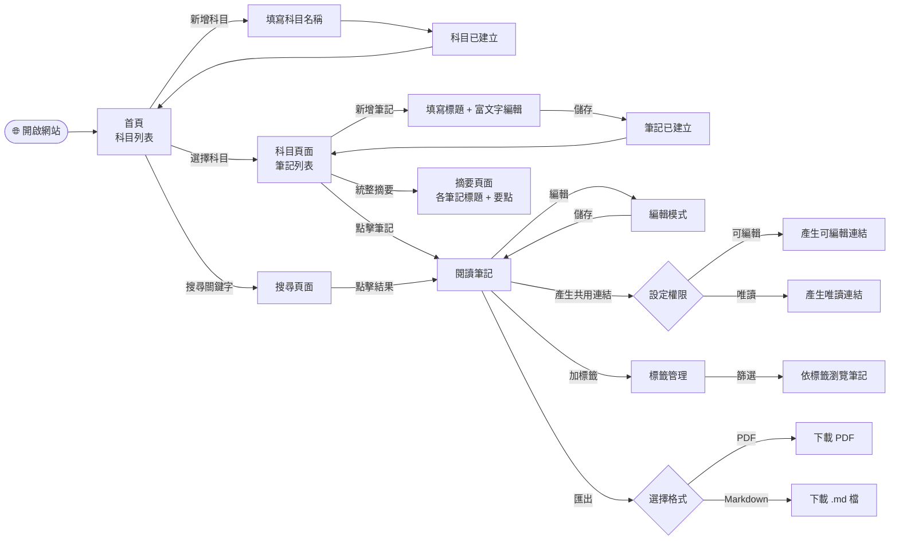
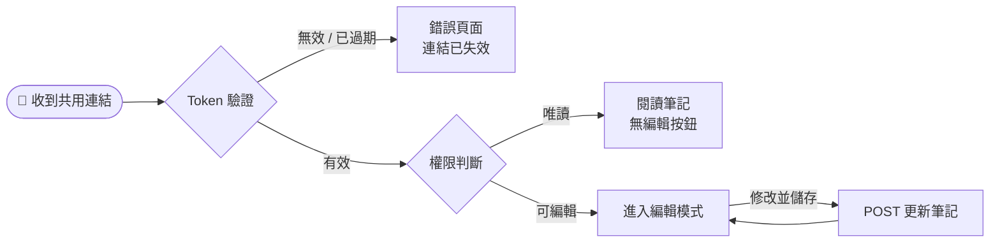
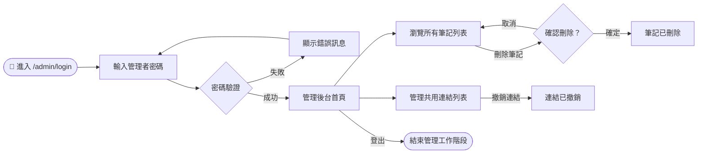
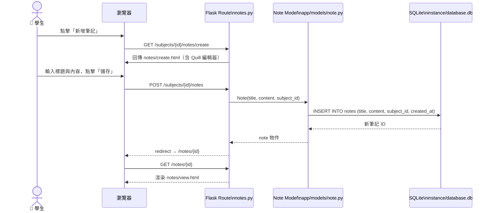
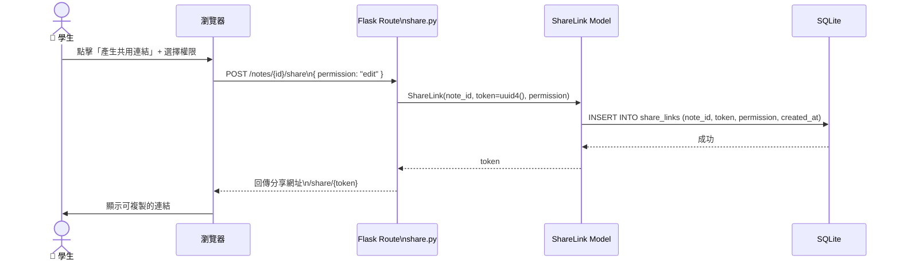
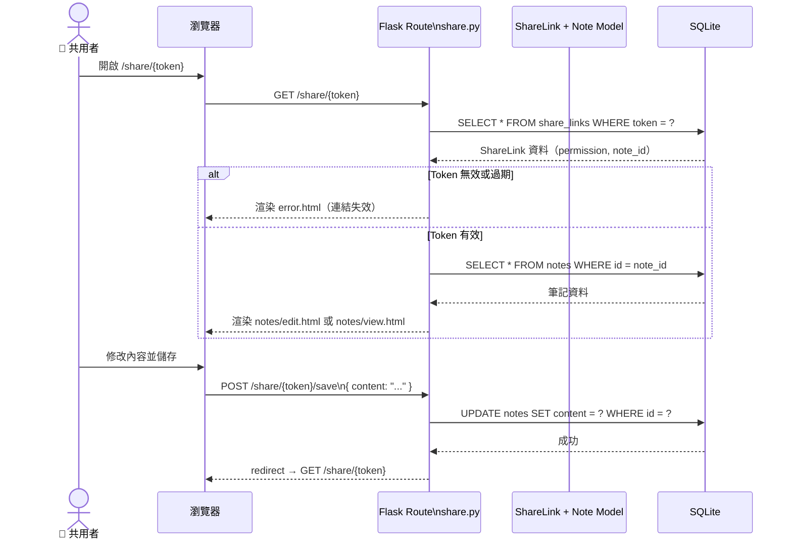
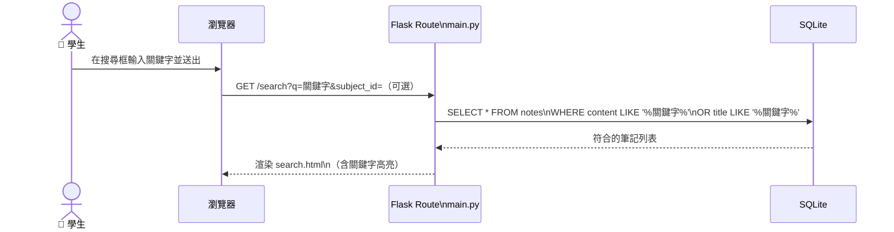
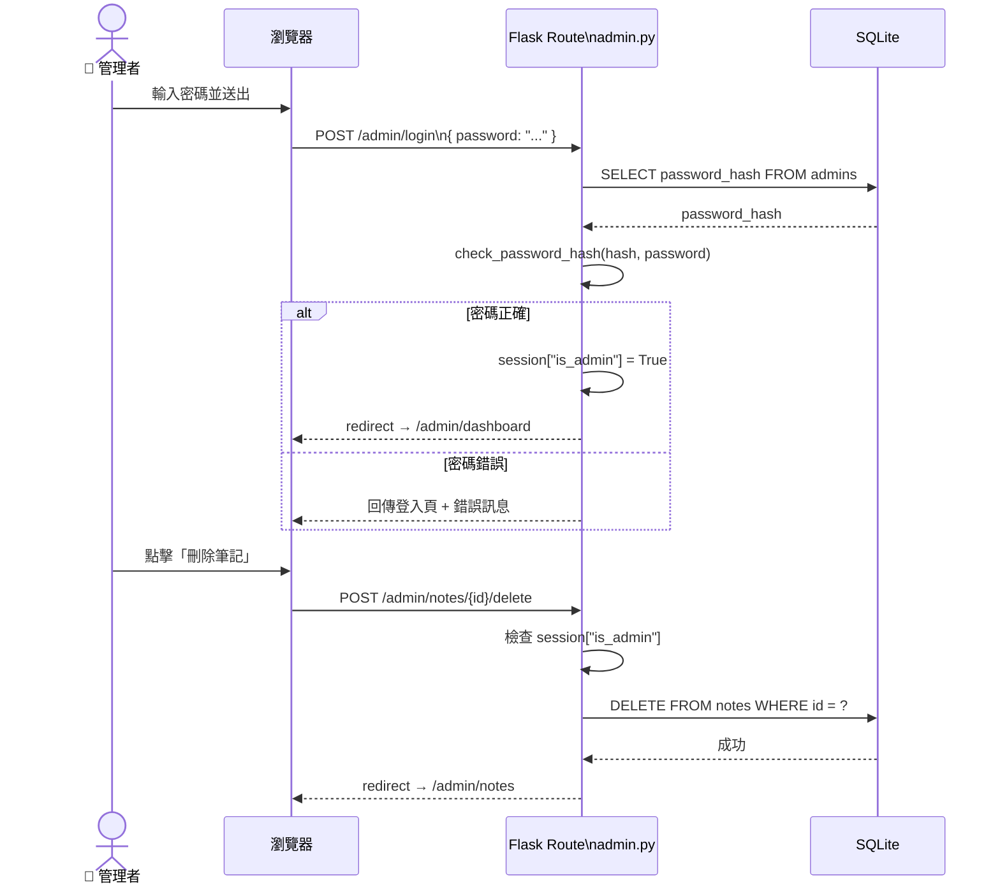

# 📊 讀書筆記本系統 — 流程圖文件（FLOWCHART）

> **版本**：v1.0  
> **建立日期**：2026-04-09  
> **參考文件**：docs/PRD.md v1.0、docs/ARCHITECTURE.md v1.0

---

## 1. 使用者流程圖（User Flow）

描述不同角色（學生、共用者、管理者）從進入網站到完成操作的完整路徑。

### 1.1 學生主要操作流程

---

### 1.2 共用者（無帳號）操作流程

---

### 1.3 管理者操作流程

---

## 2. 系統序列圖（Sequence Diagram）

描述使用者操作到資料庫存取的完整技術流程。

### 2.1 新增筆記

---

### 2.2 產生共用連結

---

### 2.3 共用者透過連結編輯

---

### 2.4 全文搜尋

---

### 2.5 管理者登入與刪除筆記

---

## 3. 功能清單對照表

| 功能 | 說明 | URL 路徑 | HTTP 方法 |
|------|------|----------|-----------|
| 首頁 | 顯示所有科目列表 | `/` | GET |
| 新增科目 | 填寫科目名稱並建立 | `/subjects/create` | GET / POST |
| 科目詳細頁 | 顯示科目下所有筆記 | `/subjects/<id>` | GET |
| 刪除科目 | 刪除指定科目 | `/subjects/<id>/delete` | POST |
| 新增筆記 | 富文字編輯並建立筆記 | `/subjects/<id>/notes/create` | GET / POST |
| 閱讀筆記 | 顯示筆記內容（唯讀） | `/notes/<id>` | GET |
| 編輯筆記 | 修改筆記內容 | `/notes/<id>/edit` | GET / POST |
| 刪除筆記 | 刪除指定筆記 | `/notes/<id>/delete` | POST |
| 統整摘要 | 顯示科目下筆記摘要 | `/subjects/<id>/summary` | GET |
| 全文搜尋 | 關鍵字搜尋所有筆記 | `/search?q=<keyword>` | GET |
| 標籤列表 | 顯示所有標籤 | `/tags` | GET |
| 新增標籤 | 建立自訂標籤 | `/tags/create` | POST |
| 筆記加標籤 | 為筆記指定標籤 | `/notes/<id>/tags` | POST |
| 依標籤篩選 | 顯示特定標籤的筆記 | `/tags/<id>/notes` | GET |
| 產生共用連結 | 建立 UUID 分享連結 | `/notes/<id>/share` | POST |
| 共用連結存取 | 透過 Token 開啟筆記 | `/share/<token>` | GET |
| 共用連結儲存 | 透過 Token 儲存編輯 | `/share/<token>/save` | POST |
| 匯出 PDF | 下載筆記 PDF | `/notes/<id>/export/pdf` | GET |
| 匯出 Markdown | 下載筆記 .md | `/notes/<id>/export/md` | GET |
| 管理者登入 | 驗證管理者密碼 | `/admin/login` | GET / POST |
| 管理者後台 | 管理者儀表板 | `/admin/dashboard` | GET |
| 管理筆記列表 | 瀏覽所有筆記 | `/admin/notes` | GET |
| 管理者刪除筆記 | 強制刪除任意筆記 | `/admin/notes/<id>/delete` | POST |
| 管理共用連結 | 查看 / 撤銷共用連結 | `/admin/links` | GET |
| 撤銷共用連結 | 停用指定 Token | `/admin/links/<id>/revoke` | POST |
| 管理者登出 | 清除管理 Session | `/admin/logout` | POST |

---

*本文件由 Antigravity AI 輔助產出，Mermaid 圖可直接在 GitHub / Notion 預覽渲染。*
